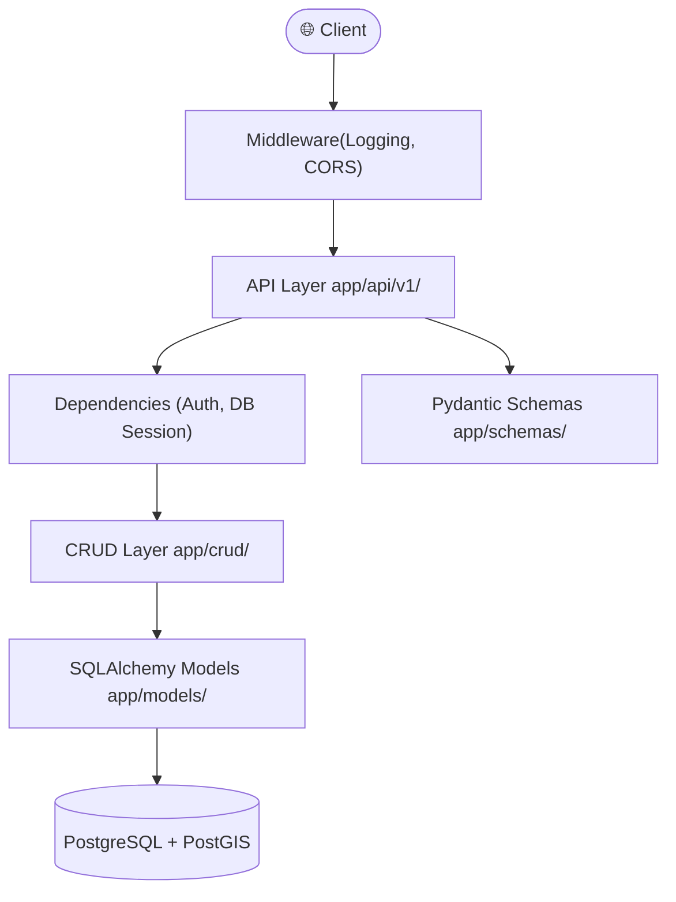
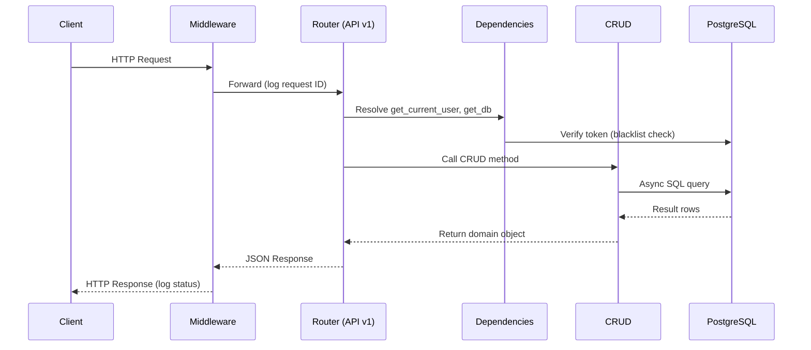

# Architecture

The project follows a modular and layered architecture to ensure maintainability, scalability, and ease of testing.

---

## High-Level Overview



---

## Directory Structure

```text
src/
├── alembic.ini                 # Alembic configuration
├── .env                        # Environment variables (not committed)
├── migrations/                 # Alembic migration scripts
│   └── versions/
└── app/
    ├── main.py                 # Application entry point
    ├── api/
    │   ├── dependencies.py     # Shared FastAPI dependencies (auth, db)
    │   └── v1/                 # Versioned route handlers
    │       ├── health.py
    │       ├── login.py
    │       ├── logout.py
    │       └── user.py
    ├── core/
    │   ├── config.py           # Pydantic settings (all env vars)
    │   ├── logger.py           # structlog configuration
    │   ├── setup.py            # Application factory
    │   ├── auth/               # JWT, hashing, security
    │   ├── database/           # Engine, session, base model
    │   ├── exceptions/         # Custom HTTP exceptions
    │   └── helper/             # Pagination and common utilities
    ├── crud/                   # Database CRUD operations
    ├── models/                 # SQLAlchemy ORM models
    ├── schemas/                # Pydantic request/response schemas
    └── middleware/             # Custom FastAPI middlewares
```

---

## Key Components

### 1. API Layer (`app/api/`)

Defines RESTful endpoints. Responsibilities:

- Validate incoming requests using Pydantic schemas
- Extract dependencies (current user, DB session)
- Delegate business logic to the CRUD layer
- Return typed responses

```python
@router.post("/user", response_model=UserRead, status_code=201)
async def write_user(
    user: UserCreate,
    db: Annotated[AsyncSession, Depends(get_db)],
) -> UserRead:
    ...
```

### 2. Dependencies (`app/api/dependencies.py`)

FastAPI's `Depends()` system is used to inject common logic into routes:

| Dependency | Description |
|---|---|
| `get_db` | Provides an async SQLAlchemy session |
| `get_current_user` | Validates the Bearer token and returns the authenticated user |
| `get_current_superuser` | Ensures the user has superuser privileges |
| `get_optional_user` | Returns the user if authenticated, or `None` |

### 3. CRUD Layer (`app/crud/`)

Encapsulates all database access logic. Uses a generic `CRUDBase` class that provides:

- `get(db, **filters)` — fetch a single record
- `get_multi(db, offset, limit, filters)` — fetch a paginated list
- `create(db, obj_in)` — insert a new record
- `update(db, obj, update_data)` — update a record
- `delete(db, **filters)` — soft or hard delete

### 4. Models Layer (`app/models/`)

SQLAlchemy 2.0 declarative models. All inherit from `BaseModel`, which provides:

- `id` — UUID primary key
- `created_at` / `updated_at` — auto-managed timestamps
- `is_deleted` — soft deletion flag

### 5. Schemas Layer (`app/schemas/`)

Pydantic v2 schemas for each resource. Typically split into:

| Schema | Purpose |
|---|---|
| `UserCreate` | Data the client sends to register a user |
| `UserCreateInternal` | Internal schema including `hashed_password` |
| `UserUpdate` | Partial update schema |
| `UserRead` | Data returned to the client (excludes password) |

### 6. Core Layer (`app/core/`)

The central hub:

- **`config.py`** — all configuration via `pydantic-settings`, loaded from `.env`
- **`auth/`** — JWT creation/verification and password hashing
- **`database/`** — async engine setup and session factory
- **`exceptions/`** — custom `HTTPException` subclasses (e.g. `NotFoundException`, `ForbiddenException`)
- **`helper/`** — pagination utilities

---

## Request Lifecycle



---

## Design Patterns

| Pattern | Where Used |
|---|---|
| **Application Factory** | `core/setup.py` — creates the FastAPI app with settings |
| **Dependency Injection** | `api/dependencies.py` — database sessions and authentication |
| **Repository / CRUD** | `crud/` — centralised, reusable database access |
| **Versioned API** | `/api/v1/` — backward-compatible routing |
| **Async Everything** | `asyncpg` driver + `AsyncSession` + `async def` endpoints |
| **Soft Deletion** | `is_deleted` flag on models, filtered in queries |
